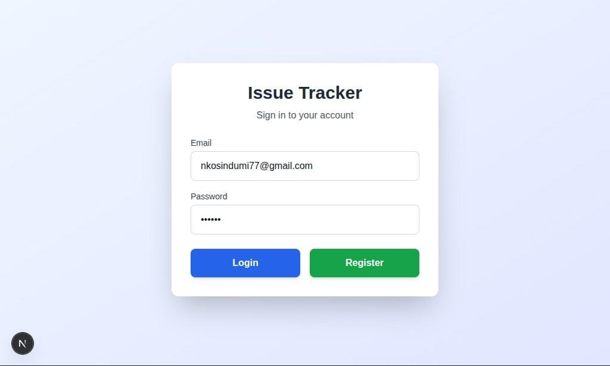
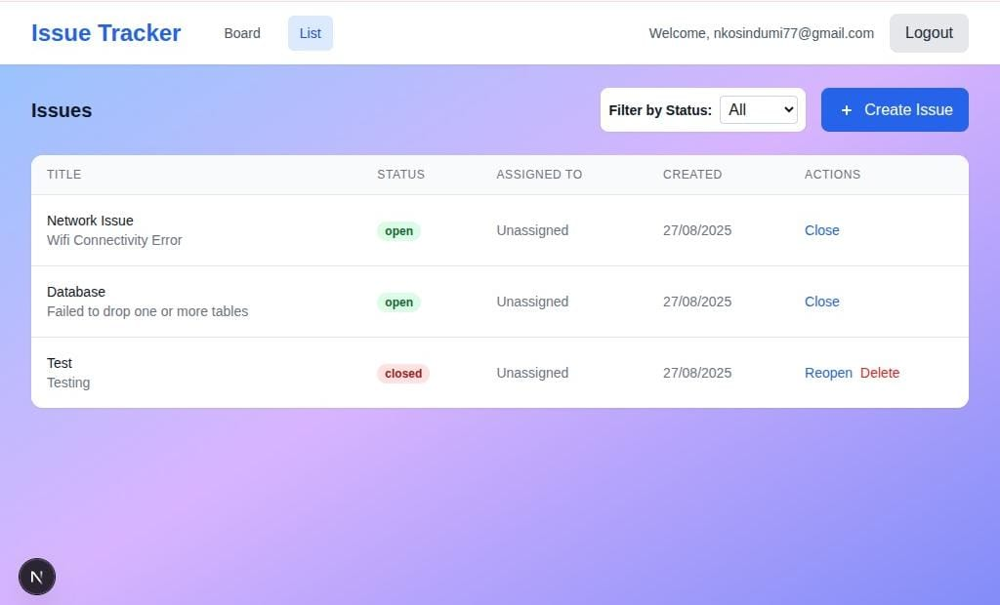
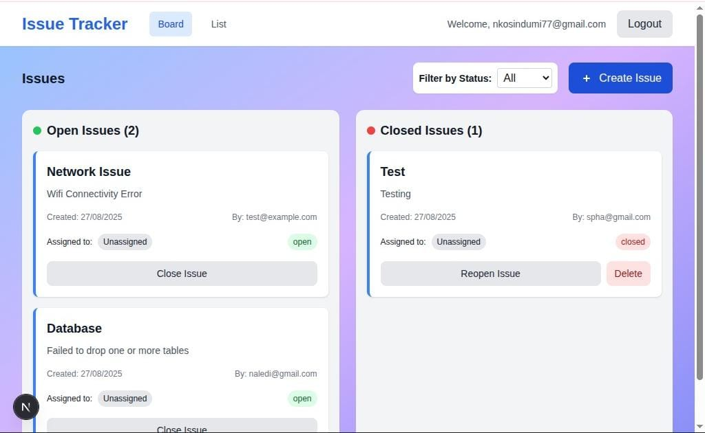

# Issue Tracker App

A minimal Issue Tracker web app built with **Next.js (frontend)**, **Express + Drizzle ORM + PostgreSQL (backend)**, and **TailwindCSS**.  

Users can:
- Register / log in
- Create, update, and delete issues
- Filter issues by status
- View issues in board or list view

## Project Structure

issue-tracker/
├─ client/ # Frontend code
├─ server/ # Backend code
├─ README.md # This file


## Screenshots

### 1. Register / Login



### 2. Dashboard / Issues Once Logged In





## Setup Instructions

1. Clone the repository:

```bash
git clone <repo-url>
cd issue-tracker
```
2. Install dependencies:
# Backend
cd server
npm install

# Frontend
cd ../client
npm install

3. Start development servers:
# Backend
cd server
npm run start

# Frontend
cd ../client
npm run dev

Visit http://localhost:3000 in your browser.

4. Run frontend tests:
cd client
npm test

Made with ❤️ by Nondumiso Nkosi